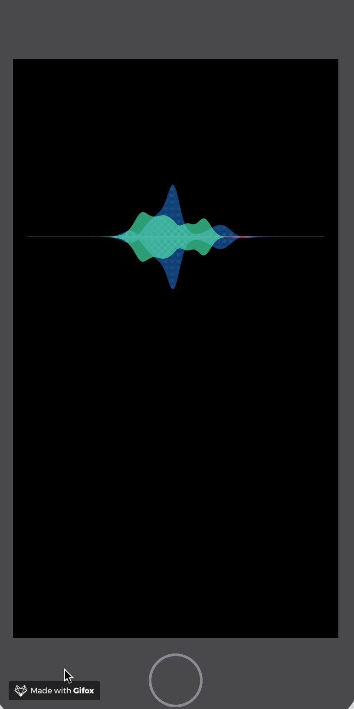

# SiriWave

The "Apple Siri" wave replicated in pure Swift.

It was inspired by this library: https://github.com/kopiro/siriwave

If you want to know what are the mathematical functions for its operation, you can read this post written by Flavio De Stefano:
https://medium.freecodecamp.org/how-i-built-siriwavejs-library-maths-and-code-behind-6971497ae5c1

### iOS 9+ style

## Usage

To use it add SiriWaveView.swift in you project.
