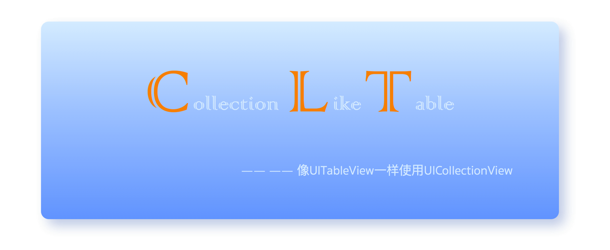
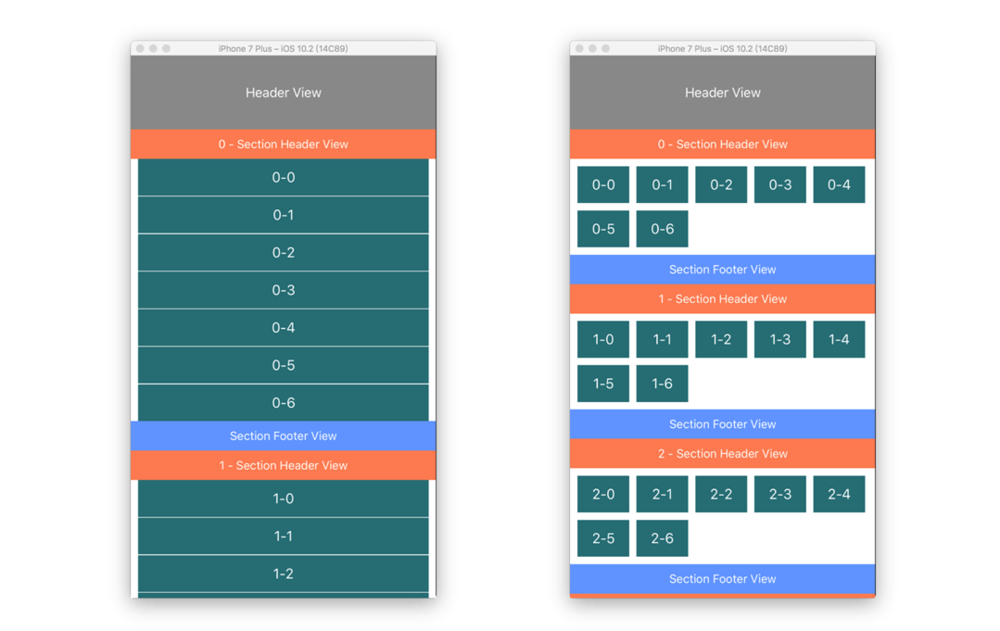

## **CLTStickyLayout** 

CLTStickyLayout是一个让你可以像**UITableView**一样使用**UICollectionView**的自定义layout。通过继承UICollectionViewLayout，来决定Cell、SupplementaryView等视图的显示。


### 特性

- 可以方便的实现SectionHeaderView和SectionFooterView
- 为SectionHeaderView增加了sticky特性
- 可以根据设置的itemSize自动决定显示效果
- 可以添加HeaderView和FooterView
- 缓存对应的高度，减少渲染的时候的计算消耗


### 自定义

提供有两种方式进行自定义，一种是使用layout的属性直接设置：

```objective-c
    @property (nonatomic) CGFloat headerHeight;// default is 0
    @property (nonatomic) CGFloat footerHeight;// default is 0

    @property (nonatomic) CGFloat sectionHeaderHeight;// default is 40
    @property (nonatomic) CGFloat sectionFooterHeight;// default is 40
    @property (nonatomic) UIEdgeInsets sectionMargin;// default is {10,10,10,10}

    @property (nonatomic) CGSize itemSize;// default is {70 50}
    @property (nonatomic) CGFloat itemHorizontalMargin;// default is 10
    @property (nonatomic) CGFloat itemVerticalMargin;// default is 10

    @property (nonatomic) BOOL stickySectionHeader;// default is YES
```

另一种是实现代理协议方法：

```objective-c
@protocol CLTStickyLayoutDelegate <NSObject>

@optional;

- (CGFloat) CLT_stickyLayoutHeaderViewHeight;
- (CGFloat) CLT_stickyLayoutFooterViewHeight;

- (CGFloat) CLT_stickyLayoutSectionHeaderViewHeight;
- (CGFloat) CLT_stickyLayoutSectionFooterViewHeight;
- (UIEdgeInsets) CLT_stickyLayoutSectionMargin;

- (CGSize)  CLT_stickyLayoutItemSize;
- (CGFloat) CLT_stickyLayoutItemHorizontalMargin;
- (CGFloat) CLT_stickyLayoutItemVerticalMargin;

@end
```

两种方法中，代理方法的权限比较高，如果实现了协议方法，那么为layout设置属性的自定义方法就会被协议中返回的值替换。


### 如何使用

和系统提供的使用方法一致，可以如上面说的修改对应的属性，也可以实现对应的协议方法：

```objective-c
    self.layout = [[CLTStickyLayout alloc] init];
    self.layout.delegate = self;
    [self.collectionView setCollectionViewLayout:self.layout animated:YES];
```





### 待完善

添加**HeaderView**和**FooterView**使用的是SupplementaryView，其实按照逻辑来说这样的做法是不对的， 毕竟这种视图都是作为装饰使用的，就像UITableView中的HeaderView和FooterView一样，没有使用重用池。后期决定将添加的HeaderView和FooterView不使用SupplementaryView或者DecorationView，而是使用UICollectionView的子视图加入到UICollectionView上。


### 相关链接

* 对UICollectionView的简要介绍---[UICollectionView](https://developer.apple.com/library/content/documentation/WindowsViews/Conceptual/CollectionViewPGforIOS/Introduction/Introduction.html)

* 官方文档讲解自定义Layout---[creating-custom-layout](https://developer.apple.com/library/content/documentation/WindowsViews/Conceptual/CollectionViewPGforIOS/CreatingCustomLayouts/CreatingCustomLayouts.html#//apple_ref/doc/uid/TP40012334-CH5-SW1)

* 官方文档举例一个自定义Layout---[hierarchichal-tree](https://developer.apple.com/library/content/documentation/WindowsViews/Conceptual/CollectionViewPGforIOS/AWorkedExample/AWorkedExample.html#//apple_ref/doc/uid/TP40012334-CH8-SW6)

* UIKit中提供的一种Layout---[flow-layout](https://developer.apple.com/library/content/documentation/WindowsViews/Conceptual/CollectionViewPGforIOS/UsingtheFlowLayout/UsingtheFlowLayout.html#//apple_ref/doc/uid/TP40012334-CH3-SW1)

